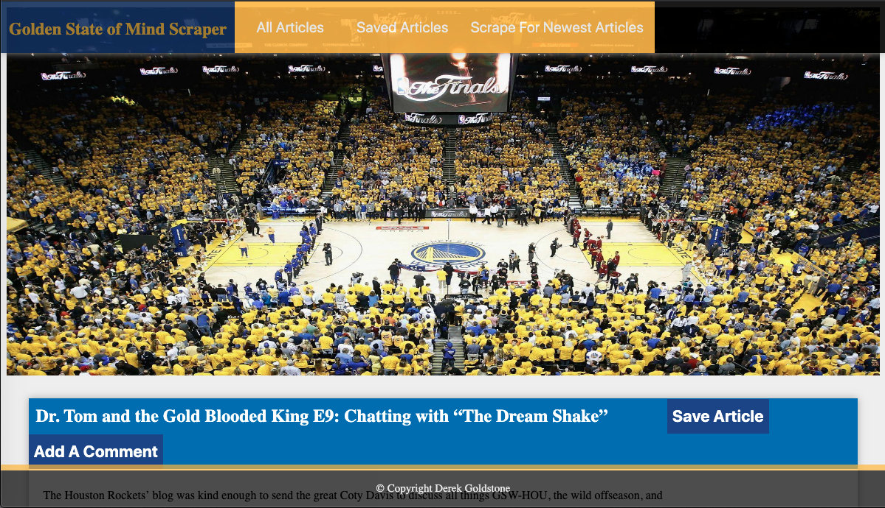
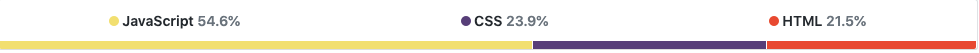

# News-Scrape

A web app that lets users view, save, and leave comments on the latest Golden State Warriors news from the Golden State of Mind blog. The app captures the title/href and summary of articles from the GSOM blog. 

[Visit the deployed page here!](https://news-scraper-dg.herokuapp.com/)
___

___

### Deployment

use npm i to install:

`cheerio`: scrapes html elements from https://www.goldenstateofmind.com/latest-news

`mongoose`: manages nosql(MongoDB) database

`express`: creates server-side routes and methods

`express-handlebars`: "A Handlebars view engine for Express which doesn't suck"

run application by using node.js

## Built With

___

* [HTML](https://developer.mozilla.org/en-US/docs/Web/Guide/HTML/HTML5)
* [CSS](https://developer.mozilla.org/en-US/docs/Web/CSS)
* [JavaScript](https://developer.mozilla.org/en-US/docs/Web/JavaScript/Reference)
* [Node.js](https://nodejs.org/en/docs/)
* [Express](https://www.npmjs.com/package/express)
* [JQuery](https://api.jquery.com/)
* [AJAX](https://api.jquery.com/category/ajax/)
* [Handlebars](https://handlebarsjs.com/)
* [MongoDB](https://docs.mongodb.com/)
* [Mongoose.js](https://mongoosejs.com/docs/index.html)
* [Cheerio.js](https://cheerio.js.org/)
* [Axios](https://github.com/axios/axios)

___

## Author:

* Derek Goldstone - [UC Berkeley Extension](https://www.linkedin.com/in/derek-goldstone-482884a3/)

___